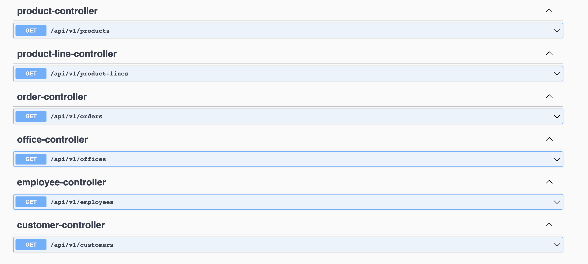
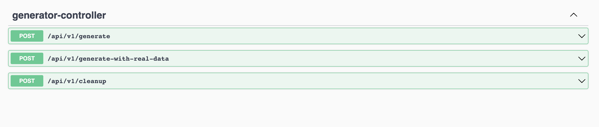

# TDM service and data generator 
Back end service and data generator which represents API for following schema: 
https://www.mysqltutorial.org/mysql-sample-database.aspx

## Open API documentation
- Open 'http://{server}:{port}/api-docs' to view documentation in JSON format for TDM service
```bash
http://localhost:8080/v3/api-docs
```
- Open 'http://{server}:{port}/swagger-ui.html' to view api endpoints for TDM service
```bash
http://localhost:8080/swagger-ui/index.html
```

<p align="left">
    
</p>

## Database setup
* Run command from __project root__ directory `docker-compose -f docker-compose-mysql.yml up`
* Verify that MySQL container is started with command `docker ps`
## Service setup
### IntelliJ
Hit play button for `com.klindziuk.sas.tdm.gen.TdmApplication`  class
### Gradle
```bash
./gradlew clean build bootRun 
```

## Data generation
### Data generation via gradle
- Fill db with synthetic data
```bash
./gradlew cleanup {gradle-task-name-for-generate-db-items} 
```
- Fill db with real data
```bash
./gradlew cleanup insertRealData  
```
#### Data generation before for performance test execution
```bash
./gradlew cleanup insertRealData(Optional) {gradle-task-name-for-generate-db-items}
./gradlew clean gatlingRun-tdm.TdmSimulation
```

### Data generation via API
Data generator is an app, so it can be started as regular Spring boot app
### IntelliJ
- Hit play button for `com.klindziuk.sas.tdm.gen.GenApplication`  class
### Gradle
```bash
./gradlew :tdm-data-generator:clean build :tdm-data-generator:bootRun 
```
### API Endpoints
Open 'http://{server}:{port}/swagger-ui.html' to view api endpoints for Test data generator
```bash
http://localhost:8081/swagger-ui/index.html
```
<p align="left">
    
</p>

## Docker setup
Test data generator could be shipped as standalone docker image and reused in pipelines
- Build Docker image for `Test Data generator`
```bash
./gradlew :tdm-data-generator:clean build :tdm-data-generator:bootBuildImage
```

## System setup via docker compose
- Build Docker images for TDM service and TDM data generator
```bash
./gradlew clean build bootBuildImage
```
- Start whole system(MySQL DB, TDM Service, TDM Data generator) via docker compose
```bash
docker-compose -f docker-compose-full.yml up
```

## Data genration configuration
Data generation properties for each table could be set via config:
```yaml
generator:
  real-data-enabled: true
  office:
    percentage-calculation: true
    synthetic-percentage: 20
    invalid-percentage: 10
    simple-generation-size: 10
  employee:
    percentage-calculation: true
    synthetic-percentage: 50
    invalid-percentage: 30
    simple-generation-size: 4
  customer:
    percentage-calculation: true
    synthetic-percentage: 70
    invalid-percentage: 10
    simple-generation-size: 10
 ...
```
